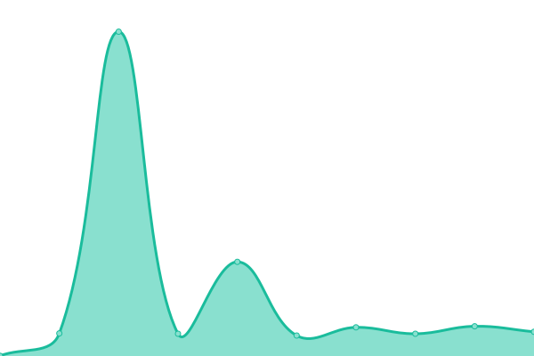

# [📈 Live Status](https://status.lumiterra.net): <!--live status--> **🟧 Partial outage**

This repository contains the open-source uptime monitor and status page for [LumiterraCommunity](https://status.lumiterra.net), powered by [Upptime](https://github.com/upptime/upptime).

With [Upptime](https://upptime.js.org), you can get your own unlimited and free uptime monitor and status page, powered entirely by a GitHub repository. We use [Issues](https://github.com/LumiterraCommunity/status-pages/issues) as incident reports, [Actions](https://github.com/LumiterraCommunity/status-pages/actions) as uptime monitors, and [Pages](https://status.lumiterra.net) for the status page.

<!--start: status pages-->
<!-- This summary is generated by Upptime (https://github.com/upptime/upptime) -->
<!-- Do not edit this manually, your changes will be overwritten -->
<!-- prettier-ignore -->
| URL | Status | History | Response Time | Uptime |
| --- | ------ | ------- | ------------- | ------ |
|  [Lumi Layer3 Scan](https://scan-api.layerlumi.com) | 🟩 Up | [lumi-layer3-scan.yml](https://github.com/LumiterraCommunity/status-pages/commits/HEAD/history/lumi-layer3-scan.yml) | 

 706ms
     
 | 

<a href="https://status.lumiterra.net/history/lumi-layer3-scan">100.00%</a>
    

|  Lumi Layer3 Rollup | 🟩 Up | [lumi-layer3-rollup.yml](https://github.com/LumiterraCommunity/status-pages/commits/HEAD/history/lumi-layer3-rollup.yml) | 

 560ms
     
 | 

<a href="https://status.lumiterra.net/history/lumi-layer3-rollup">99.89%</a>
    

|  [Lumi Layer3 Node](https://node.layerlumi.com/) | 🟩 Up | [lumi-layer3-node.yml](https://github.com/LumiterraCommunity/status-pages/commits/HEAD/history/lumi-layer3-node.yml) | 

 422ms
     
 | 

<a href="https://status.lumiterra.net/history/lumi-layer3-node">100.00%</a>
    

|  [Lumi Game Client](https://status-api.lumiterra.net/api/game-client) | 🟥 Down | [lumi-game-client.yml](https://github.com/LumiterraCommunity/status-pages/commits/HEAD/history/lumi-game-client.yml) | 

 1902ms
     
 | 

<a href="https://status.lumiterra.net/history/lumi-game-client">0.00%</a>
    

|  [Lumi Game Client Log](https://firebasestorage.googleapis.com/v0/b/lumiterra-c75ce.appspot.com/o/Logs%2FPing.txt?alt=media&token=dd567d27-424a-4228-af5b-7026fc8569ea) | 🟩 Up | [lumi-game-client-log.yml](https://github.com/LumiterraCommunity/status-pages/commits/HEAD/history/lumi-game-client-log.yml) | 

 421ms
     
 | 

<a href="https://status.lumiterra.net/history/lumi-game-client-log">100.00%</a>
    

|  [Game NFT Metadata V1](https://graphql-service-release.layerlumi.com/metadata/268650256) | 🟥 Down | [game-nft-metadata-v1.yml](https://github.com/LumiterraCommunity/status-pages/commits/HEAD/history/game-nft-metadata-v1.yml) | 

 188ms
     
 | 

<a href="https://status.lumiterra.net/history/game-nft-metadata-v1">99.19%</a>
    

|  [The Web3 V2](https://web3-service-v2-release.layerlumi.com) | 🟩 Up | [the-web3-v2.yml](https://github.com/LumiterraCommunity/status-pages/commits/HEAD/history/the-web3-v2.yml) | 

 583ms
     
 | 

<a href="https://status.lumiterra.net/history/the-web3-v2">99.53%</a>
    

|  [Game NFT Metadata V2](https://graphql-service-v2-release.layerlumi.com/metadata/268665104) | 🟩 Up | [game-nft-metadata-v2.yml](https://github.com/LumiterraCommunity/status-pages/commits/HEAD/history/game-nft-metadata-v2.yml) | 

 175ms
     
 | 

<a href="https://status.lumiterra.net/history/game-nft-metadata-v2">96.38%</a>
    

|  [Debug service](https://google.com) | 🟩 Up | [debug-service.yml](https://github.com/LumiterraCommunity/status-pages/commits/HEAD/history/debug-service.yml) | 

 201ms
     
 | 

<a href="https://status.lumiterra.net/history/debug-service">99.90%</a>
    

<!--end: status pages-->

[**Visit our status website →**](https://status.lumiterra.net)

## 📄 License

- Powered by: [Upptime](https://github.com/upptime/upptime)
- Code: [MIT](./LICENSE) © [Anand Chowdhary](https://anandchowdhary.com), supported by [Pabio](https://pabio.com)
- Data in the `./history` directory: [Open Database License](https://opendatacommons.org/licenses/odbl/1-0/)
