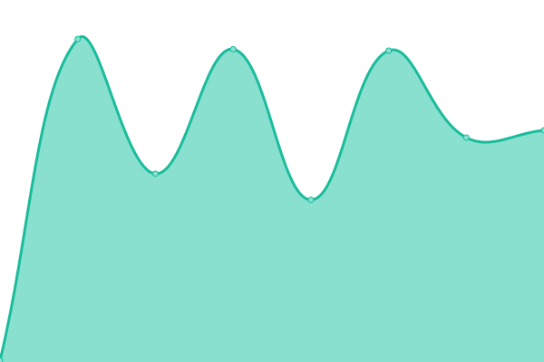

# [📈 Live Status](https://status.lumiterra.net): <!--live status--> **🟧 Partial outage**

This repository contains the open-source uptime monitor and status page for [LumiterraCommunity](https://status.lumiterra.net), powered by [Upptime](https://github.com/upptime/upptime).

With [Upptime](https://upptime.js.org), you can get your own unlimited and free uptime monitor and status page, powered entirely by a GitHub repository. We use [Issues](https://github.com/LumiterraCommunity/status-pages/issues) as incident reports, [Actions](https://github.com/LumiterraCommunity/status-pages/actions) as uptime monitors, and [Pages](https://status.lumiterra.net) for the status page.

<!--start: status pages-->
<!-- This summary is generated by Upptime (https://github.com/upptime/upptime) -->
<!-- Do not edit this manually, your changes will be overwritten -->
<!-- prettier-ignore -->
| URL | Status | History | Response Time | Uptime |
| --- | ------ | ------- | ------------- | ------ |
|  [Lumi Layer3 Scan](https://scan-api.layerlumi.com) | 🟩 Up | [lumi-layer3-scan.yml](https://github.com/LumiterraCommunity/status-pages/commits/HEAD/history/lumi-layer3-scan.yml) | 

 810ms
     
 | 

<a href="https://status.lumiterra.net/history/lumi-layer3-scan">99.95%</a>
    

|  Lumi Layer3 Rollup | 🟩 Up | [lumi-layer3-rollup.yml](https://github.com/LumiterraCommunity/status-pages/commits/HEAD/history/lumi-layer3-rollup.yml) | 

 445ms
     
 | 

<a href="https://status.lumiterra.net/history/lumi-layer3-rollup">99.87%</a>
    

|  [Lumi Layer3 Node](https://node.layerlumi.com/) | 🟩 Up | [lumi-layer3-node.yml](https://github.com/LumiterraCommunity/status-pages/commits/HEAD/history/lumi-layer3-node.yml) | 

 331ms
     
 | 

<a href="https://status.lumiterra.net/history/lumi-layer3-node">100.00%</a>
    

|  [Lumi Game Client](https://status-api.lumiterra.net/api/game-client) | 🟥 Down | [lumi-game-client.yml](https://github.com/LumiterraCommunity/status-pages/commits/HEAD/history/lumi-game-client.yml) | 

 1966ms
     
 | 

<a href="https://status.lumiterra.net/history/lumi-game-client">100.00%</a>
    

|  [Game NFT Metadata V1](https://graphql-service-release.layerlumi.com/metadata/268650256) | 🟩 Up | [game-nft-metadata-v1.yml](https://github.com/LumiterraCommunity/status-pages/commits/HEAD/history/game-nft-metadata-v1.yml) | 

 197ms
     
 | 

<a href="https://status.lumiterra.net/history/game-nft-metadata-v1">99.95%</a>
    

|  [The Web3 V2](https://web3-service-v2-release.layerlumi.com) | 🟩 Up | [the-web3-v2.yml](https://github.com/LumiterraCommunity/status-pages/commits/HEAD/history/the-web3-v2.yml) | 

 179ms
     
 | 

<a href="https://status.lumiterra.net/history/the-web3-v2">99.95%</a>
    

|  [Monad Balance GameRollupAccount](https://status-api.lumiterra.net/api/monad-balance-game-rollup) | 🟩 Up | [monad-balance-game-rollup-account.yml](https://github.com/LumiterraCommunity/status-pages/commits/HEAD/history/monad-balance-game-rollup-account.yml) | 

 178ms
     
 | 

<a href="https://status.lumiterra.net/history/monad-balance-game-rollup-account">100.00%</a>
    

|  [Monad Balance SnapshotAccount](https://status-api.lumiterra.net/api/monad-balance-snapshort) | 🟥 Down | [monad-balance-snapshot-account.yml](https://github.com/LumiterraCommunity/status-pages/commits/HEAD/history/monad-balance-snapshot-account.yml) | 

 286ms
     
 | 

<a href="https://status.lumiterra.net/history/monad-balance-snapshot-account">0.00%</a>
    

<!--end: status pages-->

[**Visit our status website →**](https://status.lumiterra.net)

## 📄 License

- Powered by: [Upptime](https://github.com/upptime/upptime)
- Code: [MIT](./LICENSE) © [Anand Chowdhary](https://anandchowdhary.com), supported by [Pabio](https://pabio.com)
- Data in the `./history` directory: [Open Database License](https://opendatacommons.org/licenses/odbl/1-0/)
